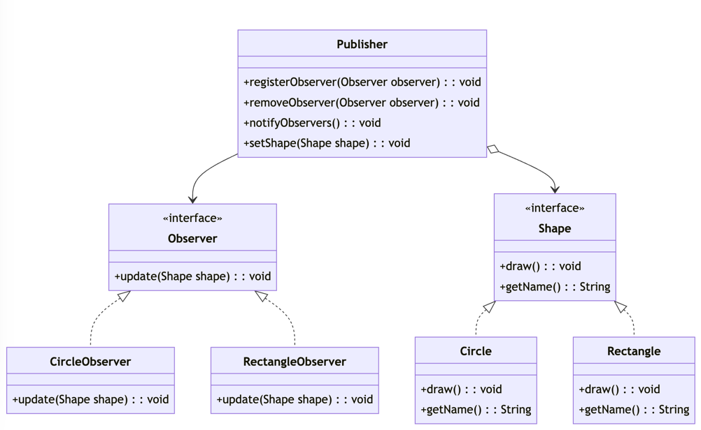

# Observer Pattern

## Overview
The `Observer Pattern` is a behavioral design pattern that defines a one-to-many relationship between objects. When the state of a subject (publisher) changes, all its dependents (observers/subscribers) are notified and updated automatically.
This pattern is useful when changes to one object need to trigger updates in other related objects, promoting loose coupling between them.

## Classes

### Publisher
The `Publisher` class acts as the subject that maintains a list of `observers` and notifies them when its state changes (e.g., when a new `Shape` is set). It manages the registration and removal of `observers`.

#### Methods
- `void registerObserver(Observer observer)`: Registers an observer to be notified of changes. 
- `void removeObserver(Observer observer)`: Removes an observer from the notification list. 
- `void notifyObservers()`: Notifies all registered observers of the current shape. 
- `void setShape(Shape shape)`: Sets a new shape and triggers notifications to observers.

### Observer
The `Observer` interface defines the method that all concrete observers must implement. Observers are notified through this method whenever the subject's state changes.

#### Methods
- `void update(Shape shape)`: This method is called by the `Publisher` to notify the observer of a change in the subject's state.

### Shape
The `Shape` interface defines the basic structure for all shapes that can be drawn and observed. Concrete shapes like `Circle` and `Rectangle implement this interface.

#### Methods
- `void draw()`: This method is implemented by all concrete shapes to perform the drawing action.
- `String getName()`: Returns the name of the shape.

### Circle
The `Circle` class implements the `Shape` interface and provides the implementation for the draw method.

### Rectangle
The `Rectangle class implements the `Shape` interface and provides the implementation for the draw method.

### CircleObserver
The `CircleObserver` class implements the `Observer` interface. It listens for updates from the `Publisher` and triggers an action (drawing the shape) when notified of a `Circle` being set as the current shape.

### RectangleObserver
The `RectangleObserver` class implements the `Observer` interface. It listens for updates from the `Publisher` and triggers an action (drawing the shape) when notified of a `Rectangle` being set as the current shape.

## Usage
The `Main` class demonstrates how to use the `Observer Pattern` to create a system where observers are notified of changes in the subject (`Publisher`).

```java
public class Main {
	public static void main(String[] args) {
		Publisher publisher = new Publisher();

		Observer circleObserver = new CircleObserver();
		Observer rectangleObserver = new RectangleObserver();

		publisher.registerObserver(circleObserver);
		publisher.registerObserver(rectangleObserver);

		Shape circle = new Circle();
		publisher.setShape(circle);  // This will notify circleObserver and trigger the drawing of a circle

		Shape rectangle = new Rectangle();
		publisher.setShape(rectangle);  // This will notify rectangleObserver and trigger the drawing of a rectangle
	}
}
```

### Explanation
1. `Publisher` manages the list of observers and notifies them whenever a new shape is set.
2. `CircleObserver` and `RectangleObserver listen for changes in the `Publisher` and respond when the relevant shape is set.
3. The `Main` class demonstrates registering observers with the `Publisher` and triggering notifications by setting different shapes.

## Advantages of the Observer Pattern

### Loose Coupling
The `Observer Pattern` promotes loose coupling between the `Publisher and its observers. The Publisher only knows that it has a list of observers to notify; it does not need to know their specific types or details. This makes the system more flexible and easier to extend or modify.

### Scalability
New observers can be added without modifying the existing `Publisher` or other observers. You simply implement the `Observer` interface in the new class and register it with the `Publisher`. The `Publisher will notify all registered observers without requiring any changes to its implementation.

#### Example
Suppose you want to add a new shape called `Triangle` that should be notified when other shapes are drawn. We can do this without modifying the existing code by following these steps:

1. Create a `Triangle` class that implements the `Shape` interface.

```java
public class Triangle implements Shape {
	@Override
	public void draw() {
		System.out.println("Drawing a triangle ▲ ");
	}

	@Override
	public String getName() {
		return "Triangle";
	}
}
```

2. Create a `TriangleObserver` class that implements the `Observer` interface.

```java
public class TriangleObserver implements Observer {
    @Override
    public void update(Shape shape) {
        if (shape instanceof Triangle) {
            shape.draw();
        }
    }
}
```

3. Register the `TriangleObserver` instance as an observer to the `Publisher`.

```java
public class Main {
	public static void main(String[] args) {
		Publisher publisher = new Publisher();

		Observer triangleObserver = new TriangleObserver();
		publisher.registerObserver(triangleObserver);

		Shape triangle = new Triangle();
		publisher.setShape(triangle);  // This will notify triangleObserver and trigger the drawing of a triangle
	}
}
```

Now, the `TriangleObserver` will be notified whenever a new shape (specifically a `Triangle`) is set in the `Publisher`.

### Class Diagram



In this diagram, `Publisher` is the subject that manages the observers, while `CircleObserver` and `RectangleObserver` are concrete observers that respond to changes in the `Publisher`. `Shape` is the interface for all shapes, and `Circle` and `Rectangle` are specific implementations.