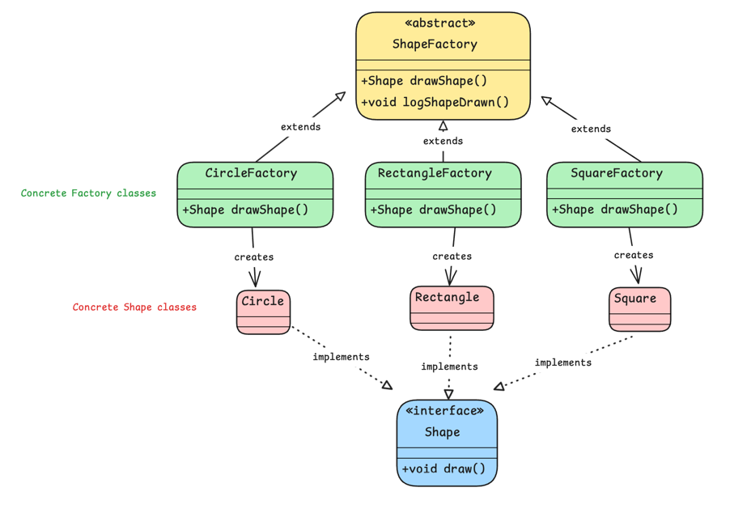

# Factory Method Pattern

## Overview
The Factory Method Pattern is a creational design pattern that defines an interface for creating objects but allows subclasses to alter the type of objects that will be created. It enables a class to defer instantiation to its subclasses, promoting greater flexibility and extensibility.

## Classes

### ShapeFactory
The `ShapeFactory` class is an abstract class that defines the `drawShape` method, which must be implemented by its subclasses to create specific shapes. It also provides a `logShapeDrawn` method that logs the type of shape created.

#### Methods
- `Shape drawShape()`: This is an abstract method that subclasses must implement to create instances of specific shapes.
- `void logShapeDrawn()`: This method logs the type of shape that was created by calling `drawShape` and then logging the class name of the shape. This is a common behavior that can be shared among all subclasses.

### CircleFactory
The `CircleFactory` class extends `ShapeFactory` and provides the implementation for the `drawShape` method to create `Circle` objects.

### RectangleFactory
The `RectangleFactory` class extends `ShapeFactory` and provides the implementation for the `drawShape` method to create `Rectangle` objects.

### SquareFactory
The `SquareFactory` class extends `ShapeFactory` and provides the implementation for the `drawShape` method to create `Square` objects.

### Shape
The `Shape` interface defines a method that all concrete shapes must implement.

#### Methods
- `void draw()`: This method is implemented by all concrete shapes to perform the drawing action.

### Circle
The `Circle` class implements the `Shape` interface and provides the implementation for the draw method.

### Rectangle
The `Rectangle class implements the `Shape` interface and provides the implementation for the draw method.

### Square
The `Square` class implements the `Shape` interface and provides the implementation for the draw method.

## Usage
The `Main` class demonstrates how to use different `ShapeFactory` subclasses to create and draw different shapes.

```java
public class Main {
    public static void main(String[] args) {
        ShapeFactory circleFactory = new CircleFactory();
        Shape circle = circleFactory.drawShape();
        circle.draw();
        circleFactory.logShapeDrawn();

        ShapeFactory rectangleFactory = new RectangleFactory();
        Shape rectangle = rectangleFactory.drawShape();
        rectangle.draw();
        rectangleFactory.logShapeDrawn();

        ShapeFactory squareFactory = new SquareFactory();
        Shape square = squareFactory.drawShape();
        square.draw();
        squareFactory.logShapeDrawn();
    }
}
```

## Advantages of the Factory Method Pattern

### Extensibility
The Factory Method Pattern promotes easy extensibility. When you need to add a new shape, you simply:

1. Create a new subclass of `ShapeFactory` that implements the `drawShape` method for the new shape.
2. Define the new shape class that implements the `Shape` interface.

This allows the system to grow without altering existing code, adhering to the `Open/Closed Principle` *(be able to extend the behavior of a class without modifying the existing code)*.

#### Example

Let's say you want to add a new shape called `Triangle`. To do this, you need to:

1. Create a new `Triangle` class that implements the `Shape interface.

```java
public class Triangle implements Shape {
	@Override
	public void draw() {
		System.out.println("Drawing a triangle");
	}
}
```

2. Create a new `TriangleFactory` class that extends `ShapeFactory` and implements the `drawShape` method to create `Triangle` objects.

```java
public class TriangleFactory extends ShapeFactory {
    @Override
    public Shape drawShape() {
        return new Triangle();
    }
}
```

Now, the `TriangleFactory` can be used to create and configure `Triangle` objects just like the other shapes, without modifying any existing code.

### Code Reuse and Maintenance
By using the Factory Method Pattern, you can centralize and reuse common behaviors (e.g., logging, applying default settings) in the abstract factory class. This makes the codebase easier to maintain, as shared logic resides in one place.

### Class Diagram

